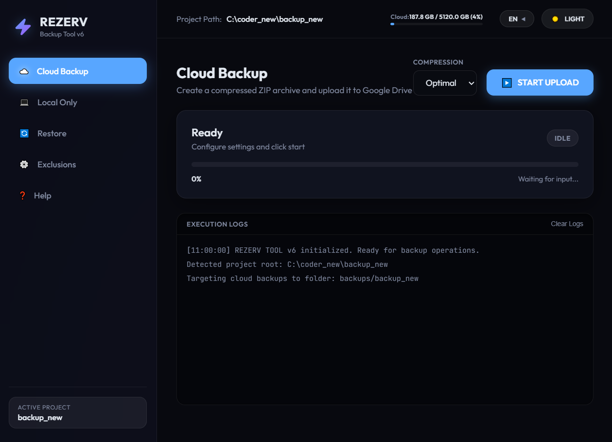
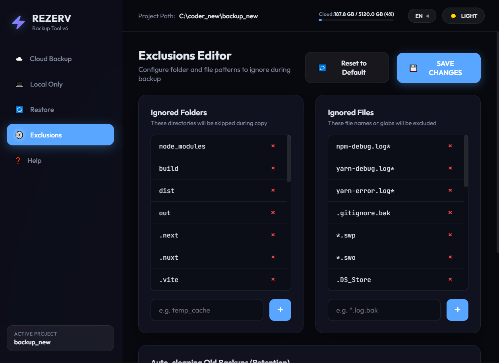

# REZERV — Smart Backup Utility for Developers

<p align="center">
  
  
</p>

**REZERV** is a modern, cross-platform desktop application built using Go and Wails. It allows developers to quickly compress their workspace folders into ZIP archives and either upload them to Google Drive or save them to a local directory with a single click.

The application features a premium **Glassmorphism** dark/light UI with smooth micro-animations, multi-language support (RU/EN), and background tray operations.

---

## 🚀 Key Features

1. **Local & Cloud Backups**:
   * **Local Backup**: Compresses the workspace into a ZIP archive and saves it locally (no internet connection required).
   * **Cloud Backup**: Automatically zips and uploads the archive to Google Drive in a structured `backups/Project_Name` folder.
2. **Bandwidth Limits & Thread Control**:
   * Set network speed limits (`--bwlimit`) to avoid throttling your internet connection.
   * Customize concurrent transfers (`--transfers`) to significantly boost upload speed for small files.
3. **Fault-Tolerant Resumable Chunk Uploads**:
   * Built-in retry mechanism (configured with 5 global retries and 10 low-level chunk retries) to ensure large file uploads survive temporary network drops.
4. **Intelligent Retention Policy (Auto-Cleanup)**:
   * Keep your cloud and local storage clean. Define a threshold (e.g., keep only the 5 most recent backups), and the app will auto-delete the oldest backups after a successful upload.
5. **Real-time Cloud Disk Quota Widget**:
   * The header display monitors Google Drive utilization (used space vs. total allocation) with dynamic warning colors as storage limits are reached.
6. **Smooth Drag-and-Drop Workspace Selection**:
   * Switch the active project workspace instantly by dragging a folder from Windows Explorer or macOS Finder and dropping it onto the application window.
7. **Tray Minimization & Single Instance Lock**:
   * Minimizes cleanly to the system tray (taskbar on Windows or status bar on macOS) on close.
   * Employs `SingleInstanceLock` to restore the active window if you attempt to launch the executable again.

---

## 🛠️ Project Architecture

REZERV is designed with a lightweight hybrid architecture:
*   **Backend (Go)**: Directly handles file system manipulation, ZIP compression (using Go's native `archive/zip` library), process spawns, and system triggers.
*   **Frontend (Wails HTML/CSS/JS)**: Renders standard web code inside the native operating system webview engine (WebView2 on Windows, WebKit on macOS), resulting in minimal RAM usage and instant rendering.
*   **Cloud Engine (rclone)**: Leverages `rclone` under the hood. Processes are spawned with system flags (`CREATE_NO_WINDOW`) to prevent distracting terminal windows from flashing.

---

## 🔌 Critical Requirement: Downloading rclone

For cloud backups to function, the application requires the **rclone** binary. It is **not included** in this repository's source code to keep the repository lightweight (rclone is 70+ MB).

Before running or building the project:
1. Download the official rclone binary for your operating system from **[rclone.org/downloads](https://rclone.org/downloads/)**:
   * For Windows: extract `rclone.exe`.
   * For macOS: extract the `rclone` file and make it executable (`chmod +x rclone`).
2. Place the executable file inside the `app/` folder next to your compiled executable (or in the root of the project during development).

---

## 💻 How to Build from Source

Since Wails uses native system webviews and Go's CGO, cross-compilation is not supported. You must compile the binary on your target OS.

### 📋 Prerequisites:
1. Install **Go (Golang)** v1.18 or newer: [golang.org](https://golang.org/dl/).
2. Install **Node.js** v18 or newer: [nodejs.org](https://nodejs.org/).
3. Install the **Wails CLI**:
   ```bash
   go install github.com/wailsapp/wails/v2/cmd/wails@latest
   ```

### 🔨 Compilation:

1. Navigate to the project root directory:
   ```bash
   cd github/rezerv-wails
   ```
2. Build the production binary for your current operating system:
   ```bash
   wails build
   ```
3. Find your standalone executable in `build/bin/`:
   * On Windows: `rezerv-wails.exe`
   * On macOS: `rezerv-wails.app` (native macOS application bundle)

### 🧪 Live Development:
```bash
wails dev
```
In development mode, changes to Go code, HTML, CSS, or JS will immediately compile and hot-reload the running application.

---

## ☕ Support the Project (Donate)

If you find REZERV useful and want to support its active development:
> **Buy me a coffee so I can work better!** 😉

*   **Currency**: USDT (Tether)
*   **Network**: TON (The Open Network)
*   **Wallet Address**: `UQAWCYBzl-C1ZWHvSwY1GSsZ6SxKtiXqtd_HNZ2xItz935zD`

<p align="left">
  
</p>
