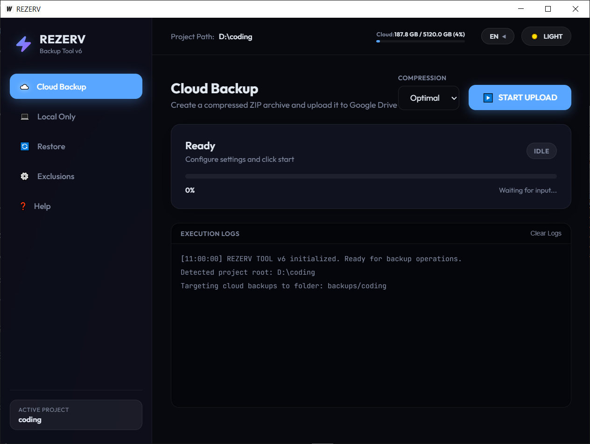
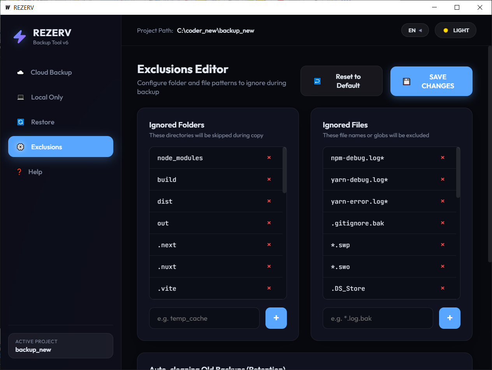

# REZERV — Умная утилита резервного копирования для разработчиков

<p align="center">
  
  
</p>

**REZERV** — это современное кросс-платформенное десктопное приложение, разработанное на Go и Wails. Утилита позволяет быстро создавать архивы ваших рабочих проектов и выгружать их в облако Google Drive или сохранять на локальный диск в один клик.

Интерфейс приложения выполнен в современном стиле **Glassmorphic** (эффект матового стекла) с поддержкой темного/светлого оформления, плавной анимацией и поддержкой русского и английского языков.

---

## 🚀 Основные возможности

1. **Локальный и Облачный бэкап**:
   * **Локальный**: Архивирует выбранную папку в ZIP и сохраняет в отдельный каталог на вашем ПК (работает без интернета).
   * **Облачный**: Создает ZIP-архив и выгружает его в Google Drive (в структурированную папку `backups/Имя_Проекта`).
2. **Многопоточность и Сетевые лимиты**:
   * Настройка ограничения скорости выгрузки (`--bwlimit`) для разгрузки вашего интернет-канала.
   * Настройка количества параллельных потоков копирования (`--transfers`) для максимального ускорения загрузки мелких файлов.
3. **Устойчивость к разрывам соединения (Докачка)**:
   * Автоматический повтор отправки блоков при сбоях сети (rclone настроен на 5 глобальных попыток и 10 низкоуровневых повторов для каждого чанка).
4. **Автоочистка старых копий (Ротация / Retention Policy)**:
   * Задайте лимит хранимых архивов (например, оставлять только последние 5 копий). Программа сама сотрет старые бэкапы локально или в облаке после успешного завершения новой операции.
5. **Мониторинг квоты диска**:
   * Красивый виджет в шапке программы отображает заполненность вашего Google Drive (в GB и процентах) с цветовым индикатором предупреждения о переполнении.
6. **Интуитивный Drag-and-Drop**:
   * Переключите активный проект мгновенно, просто перетащив папку из Проводника Windows или macOS Finder прямо в окно программы.
7. **Работа в фоновом режиме (Системный трей)**:
   * Программа сворачивается в трей (рядом с часами) при закрытии и не мешает на панели задач.
   * Блокировка повторных запусков (`SingleInstanceLock`) разворачивает уже запущенное приложение из трея.

---

## 🛠️ Из чего состоит проект (Архитектура)

Проект имеет модульную гибридную архитектуру:
*   **Бэкенд (Go)**: Управляет файловой системой, сжатием архивов (стандартный `archive/zip`), вызывает системные команды и управляет фоновыми процессами.
*   **Интерфейс (Wails + Frontend)**: Веб-стек (HTML, CSS, JS) исполняется внутри нативного системного движка WebView (WebView2 на Windows, WebKit на macOS), что обеспечивает минимальное потребление ОЗУ и высокую скорость работы.
*   **Движок загрузки (rclone)**: Для работы с Google Drive под капотом используется мощная консольная утилита `rclone`. Приложение вызывает её скрыто без мелькания черных консольных окон cmd за счет системного флага `CREATE_NO_WINDOW`.

---

## 🔌 Важное примечание: Загрузка rclone

Для работы облачных бэкапов приложению требуется исполняемый файл **rclone**. Он специально **не поставляется** в исходном коде репозитория из-за большого веса утилиты (более 70 МБ).

Перед запуском или сборкой вам необходимо:
1. Скачать официальный rclone для вашей ОС с сайта **[rclone.org/downloads](https://rclone.org/downloads/)**:
   * Для Windows: скачайте архив и извлеките `rclone.exe`.
   * Для macOS: скачайте macOS zip (ARM64 для Apple Silicon M1/M2/M3 или Intel), извлеките файл `rclone` и дайте ему права на исполнение (`chmod +x rclone`).
2. Положите скачанный файл `rclone.exe` (или `rclone` на macOS) в папку `app/` рядом со скомпилированным приложением (или в корень проекта во время разработки).

---

## 💻 Как собрать проект самостоятельно

Так как Wails использует нативный системный WebView и CGO, кросс-компиляция не поддерживается. Сборку необходимо производить на целевой ОС.

### 📋 Предварительные требования:
1. Установите **Go (Golang)** версии 1.18 или новее: [golang.org](https://golang.org/dl/).
2. Установите **Node.js** версии 18 или новее: [nodejs.org](https://nodejs.org/).
3. Установите **Wails CLI**:
   ```bash
   go install github.com/wailsapp/wails/v2/cmd/wails@latest
   ```

### 🔨 Сборка приложения:

1. Перейдите в терминале в каталог проекта:
   ```bash
   cd github/rezerv-wails
   ```
2. Соберите приложение под вашу текущую систему:
   ```bash
   wails build
   ```
3. Готовый файл появится в папке `build/bin/`:
   * На Windows: `rezerv-wails.exe`
   * На macOS: `rezerv-wails.app` (нативное приложение macOS)

### 🧪 Запуск в режиме разработки:
```bash
wails dev
```
В этом режиме любые изменения в HTML/CSS/JS или Go-файлах будут мгновенно обновлять запущенное приложение в реальном времени.
